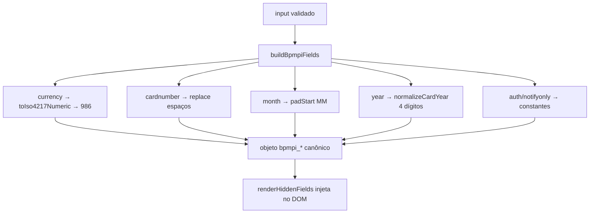

# `buildBpmpiFields.js` — o mapper

> Código: [`providers/braspag/buildBpmpiFields.js`](../../providers/braspag/buildBpmpiFields.js)

## Problema de negócio

O merchant pensa o input do jeito dele: moeda em sigla (`BRL`), cartão com espaços (`4111 1111 1111 1111`), mês `'1'`, ano `'25'`. O MPI da Braspag, porém, exige um formato **exato e canônico**: moeda numérica (`986`), cartão sem espaço, mês `MM`, ano com 4 dígitos. Alguém precisa traduzir o input do merchant no dialeto do MPI.

## Problema técnico

No projeto antigo essa tradução ficava **inline**, misturada com validação e orquestração. O resultado: o mesmo valor era "limpo pra testar" num lugar e "mandado cru" em outro — a raiz dos bugs #3/#4/#5 do review (input passa na validação mas chega torto no MPI). Agora a normalização tem **um único dono**: o mapper. É o **único** ponto que transforma valor.

## O que `buildBpmpiFields` evita

- input cru vazar pro MPI — toda normalização acontece aqui, num lugar só;
- moeda em sigla onde o MPI espera numérico (`toIso4217Numeric` → `986`);
- cartão com espaço, mês de 1 dígito, ano de 2 dígitos chegando torto no 3DS;
- o renderer ou a validação decidirem formato — **não é papel deles** (validação só lê, renderer é burro);
- `bpmpi_auth` divergir por ambiente — é constante, decidida aqui.

## Contrato

```js
buildBpmpiFields(input) // input JÁ validado → objeto bpmpi_* canônico
```

- **`input`** — o objeto de `authenticate()`, **já aprovado** por [`validate`](./types.md). O mapper assume input válido; `toIso4217Numeric` lança se a moeda for impossível (rede de segurança, não substitui a validação).
- **Retorno** — mapa plano `{ bpmpi_*: string }` pronto pra [`renderHiddenFields`](./render-hidden-fields.md) injetar no DOM.

## Normalizações

| Campo do merchant | bpmpi_* | Transformação | Exemplo |
| ----------------- | ------- | ------------- | ------- |
| `order.currency` | `bpmpi_currency` | sigla → ISO 4217 numérico | `'brl'` → `'986'` |
| `card.number` | `bpmpi_cardnumber` | remove espaços | `'4111 1111…'` → `'41111111…'` |
| `card.expirationMonth` | `bpmpi_cardexpirationmonth` | `padStart(2,'0')` | `'1'` → `'01'` |
| `card.expirationYear` | `bpmpi_cardexpirationyear` | 2 → 4 dígitos | `'25'` → `'2025'` |
| `order.amount` | `bpmpi_totalamount` | `String()` | `1000` → `'1000'` |
| — | `bpmpi_auth` | constante | `'true'` |
| — | `bpmpi_auth_notifyonly` | constante | `'false'` |

> `bpmpi_auth` / `bpmpi_auth_notifyonly` **não dependem de ambiente** — são constantes aqui. O que varia entre sandbox/produção (`scriptUrl`, `code` SDB/PRD) é resolvido por [`config.js`](./config.md), não pelo mapper.

## O lugar do mapper no fluxo

> Regra de ouro: **validação LÊ, mapper TRANSFORMA, renderer ESCREVE.** Cada um faz só o seu.

```
input cru → validate() [aceita se convertível] → buildBpmpiFields() [canoniza] → renderHiddenFields() [injeta no DOM] → MPI
```

A validação é tolerante de propósito (aceita `'brl'`, `'1'`, cartão com espaço) **porque** o mapper canoniza depois. Os dois andam juntos: validação garante que é convertível, mapper converte.

## Fluxo



## Fora de escopo

- **Validar** o input — é de [`validate`](./types.md); o mapper assume input válido.
- **Renderizar** no DOM — é de [`renderHiddenFields`](./render-hidden-fields.md); o mapper só monta o objeto.
- **Resolver ambiente** (`scriptUrl`, `code`) — é de [`config.js`](./config.md).
