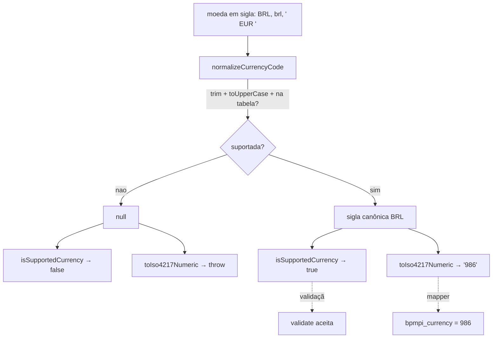

# `currency.js`

> Código: [`providers/braspag/currency.js`](../../providers/braspag/currency.js)

## Problema de negócio

O MPI da Braspag **não recebe a moeda pela sigla** (`BRL`, `EUR`) — ele espera o código **ISO 4217 numérico** no campo `bpmpi_currency` (`BRL` → `986`, `EUR` → `978`). O merchant, porém, pensa e passa a moeda como sigla. Alguém precisa traduzir sigla → número, e rejeitar moeda que não existe antes de chegar no 3DS.

## Problema técnico

A tradução e a checagem de "moeda suportada" são a mesma fonte de verdade (a tabela ISO 4217). Se isso ficar espalhado, a validação aceita uma moeda que o mapper não sabe converter — ou vice-versa. Aqui fica isolado: **uma tabela + três funções** que validação e mapper compartilham.

## O que `currency.js` evita

- aceitar na validação uma moeda que o mapper não consegue converter (mesma tabela nos dois);
- mandar a sigla crua (`BRL`) pro MPI quando ele espera o numérico (`986`);
- divergência de caixa/espaço — `' brl '` e `'BRL'` resolvem para o mesmo código;
- seguir adiante com moeda inexistente (`toIso4217Numeric('XYZ')` lança; `isSupportedCurrency('XYZ')` é `false`);
- expor a tabela — `ISO4217_ALPHA_TO_NUMERIC` é privado ao módulo; só as funções são públicas.

## Contrato

```js
normalizeCurrencyCode(' brl ') // → 'BRL'   (sigla canônica, ou null se não suportada)
isSupportedCurrency('brl')     // → true    (boolean — usado pela validação)
isSupportedCurrency('XYZ')     // → false
toIso4217Numeric('BRL')        // → '986'   (numérico p/ o MPI — usado pelo mapper)
toIso4217Numeric('XYZ')        // → throw   (Unsupported currency)
```

- **Tolerante a caixa e espaço** — `normalizeCurrencyCode` faz `trim().toUpperCase()` antes de checar.
- **`isSupportedCurrency`** nunca lança (boolean) → é o que a [validação](./types.md) usa, porque validação só lê.
- **`toIso4217Numeric`** lança em moeda não suportada → é o que o mapper usa, **depois** de validar.

## Validar ≠ normalizar

> A validação usa `isSupportedCurrency` (só LÊ, tolerante); o mapper usa `toIso4217Numeric` (TRANSFORMA pro formato do MPI). Mesma tabela, papéis diferentes.

```
'brl' → validate [isSupportedCurrency → ok] → buildBpmpiFields [toIso4217Numeric → '986'] → bpmpi_currency
```

## Resumo

Esse módulo resolve **traduzir a sigla da moeda no código ISO 4217 numérico que o MPI espera, e ser a fonte única do que é "moeda suportada"** — consumido pela [validação](./types.md) (`isSupportedCurrency`) e pelo mapper [`buildBpmpiFields`](../../providers/braspag/buildBpmpiFields.js) (`toIso4217Numeric`).

## Fluxo



## Onde fica a tabela

A tabela ISO 4217 alfabético → numérico vive **só** em `currency.js` (constante privada). O as-is mantinha num arquivo gerado por codegen (`npm run generate:iso4217`); como este repo não tem esse pipeline, ela fica inline no módulo. Nenhum outro arquivo deve repetir o mapa de moedas.
