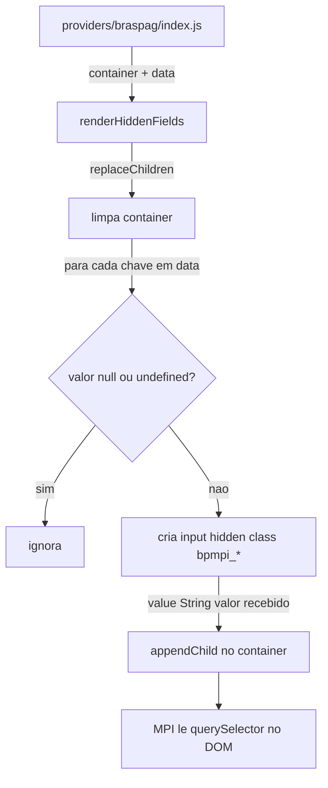

# `renderHiddenFields.js`

> Código: [`providers/braspag/renderHiddenFields.js`](../../providers/braspag/renderHiddenFields.js)

## Problema de negócio

O script MPI da Braspag **não recebe dados por parâmetro de função** — ele lê `<input type="hidden" class="bpmpi_*">` no DOM. Sem esses campos, o 3DS não sabe cartão, valor, pedido, token, etc.

## Problema técnico

No projeto antigo isso era **inline**, misturado com validação e orquestração — confuso pra quem vê o código pela primeira vez. Agora fica isolado: **traduzir um objeto JS plano em inputs ocultos com as classes que o MPI espera**.

## O que `renderHiddenFields` evita

- o merchant montar dezenas de `<input class="bpmpi_*">` na mão no HTML;
- **duplicar** inputs se `authenticate()` for chamado de novo no mesmo container (`replaceChildren` antes de injetar);
- criar inputs vazios para campos ausentes (`undefined` / `null` são ignorados).

> **`bpmpi_auth` não é decidido aqui.** O renderer é burro: grava o valor que receber no `data`. Quem decide o modo de autenticação (`bpmpi_auth` / `bpmpi_auth_notifyonly`) é o mapper (`authFields` no as-is) — default `"true"`, configurável. Forçar `"true"` no renderer tornaria impossível o fluxo analysis-only.

## Contrato

```js
renderHiddenFields(container, {
  bpmpi_cardnumber: '4111111111111111',
  bpmpi_totalamount: '1000',
  // chave ausente → nenhum input criado
});
```

- **`container`** — elemento DOM recebido por parâmetro (testável no jsdom sem HTML real).
- **`data`** — mapa plano: **chave = nome da classe CSS** (`bpmpi_*`), valor = conteúdo do input.
- **Não valida** os dados — responsabilidade de `schemas/types.js` e do orquestrador que monta o `data`.
- **Não retorna nada** — o efeito é o DOM dentro do `container`. Quem consome lê com `querySelector('.bpmpi_*')` (como o MPI).

## Resumo

Esse módulo resolve **colocar os dados da transação no DOM do jeito que o MPI da Braspag lê** — passo 8 do fluxo ([`authenticate()`](./authenticate-flow.md): orquestrador monta o `data`, `renderHiddenFields` injeta no container escondido).

## Fluxo



## Quem monta o data

O `renderHiddenFields` **só renderiza** — não sabe pedido, cartão nem ambiente. Quem traduz `authenticate(input)` → objeto `bpmpi_*` será o orquestrador (`providers/braspag/index.js`) ou um mapper dedicado, usando também `code` de [`config.js`](./config.md).

Campos típicos (referência do projeto antigo): `bpmpi_auth`, `bpmpi_accesstoken`, `bpmpi_cardnumber`, `bpmpi_totalamount`, `bpmpi_currency`, `bpmpi_ordernumber`, billing/shipping/cart — fora do escopo deste módulo.

## O lojista não vê isso

O integrador chama só `Stark3DS.authenticate(...)`. O SDK cria a div escondida, chama `renderHiddenFields`, o MPI consome, e o cleanup remove tudo — o merchant **nunca** monta HTML de `bpmpi_*`.
