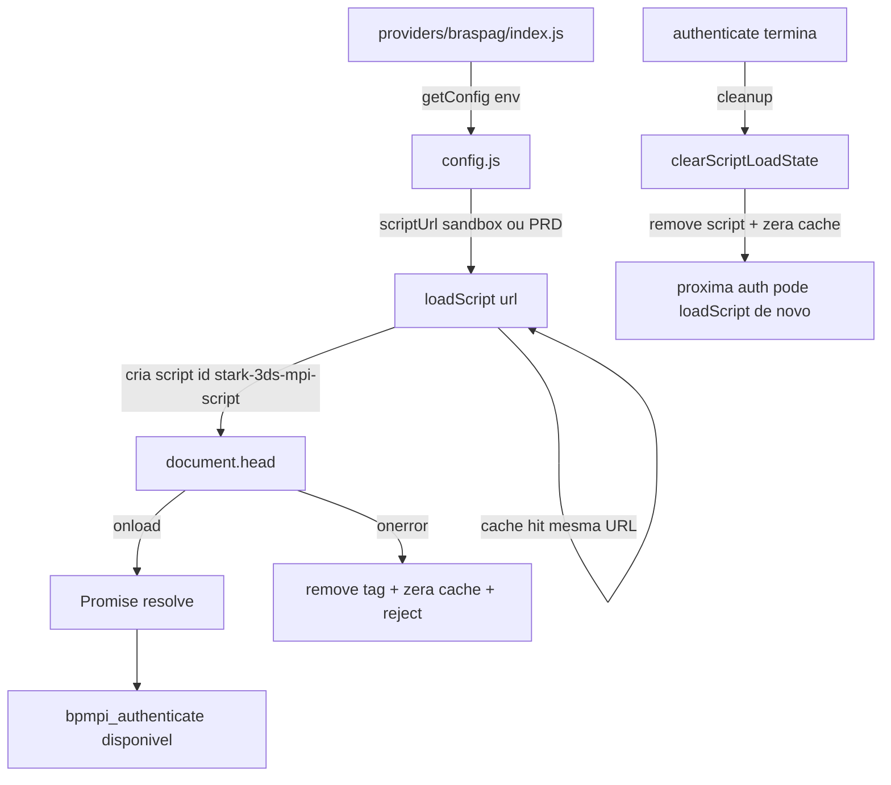

# `scriptLoader.js`

> Código: [`providers/braspag/scriptLoader.js`](../../providers/braspag/scriptLoader.js)

## Problema de negócio

O 3DS da Cielo/Braspag **só funciona no browser** se o script MPI (`BP.Mpi.3ds20.min.js`) estiver carregado na página — sem ele não existe `bpmpi_authenticate`, challenge, ECI, nada.

## Problema técnico

No projeto antigo isso era **inline**, misturado com validação, DOM e orquestração. Agora fica isolado: **baixar o script da Braspag na página, do jeito certo, uma vez por sessão**.

## O que `loadScript` evita

- o merchant ter que colocar `<script src="braspag...">` na mão no HTML;
- **duplicar** a tag se `authenticate()` for chamado duas vezes seguidas (cache de Promise);
- seguir adiante antes do arquivo **terminar de baixar** (Promise só resolve no `onload`);
- ficar **sem saber** se falhou (reject com erro);
- **não conseguir tentar de novo** depois de erro (limpa cache e remove a tag no `onerror`).

## O que `clearScriptLoadState` resolve

A MPI é **single-session** — depois de uma autenticação, se a tag ficar no DOM, a **próxima** auth na mesma página **trava**. O cleanup tira o script e zera a memória para a próxima compra funcionar.

## Resumo

Esse módulo resolve **colocar o MPI da Braspag na página de forma confiável, sem duplicar, com retry após falha, e com limpeza para a próxima autenticação** — passo 7 do fluxo ([`authenticate()`](./authenticate-flow.md): `config.js` manda a URL, `scriptLoader.js` injeta).

## Fluxo

## Onde está a URL

O `loadScript` **não sabe** sandbox vs produção — recebe a URL pronta. Quem define é `config.js` (US-04). O arquivo MPI **não fica no repo**; vem da CDN Braspag na internet.
