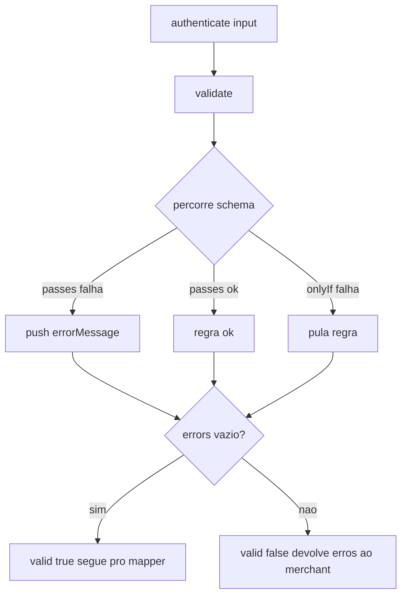

# `schemas/types.js` — validação de input

> Código: [`schemas/types.js`](../../schemas/types.js)

## Problema de negócio

Se o merchant passar dados inválidos para `authenticate()` — `amount` negativo, cartão com letras, mês `"13"` — sem validação o erro só aparece **dentro do MPI da Braspag**, com mensagem críptica. O merchant perde tempo debugando o 3DS quando o problema é no input dele.

`validate(data)` resolve isso: **erro claro e imediato, em português, antes de tocar no MPI.**

## Contrato

```js
validate(data) // → { valid: boolean, errors: string[] }
```

- `valid: true`, `errors: []` → dados corretos.
- `valid: false`, `errors: [...]` → um item por regra que falhou (**vários de uma vez**).
- Nunca lança — input vazio/`null`/`undefined` retorna `valid: false`, não quebra.

## O que valida

| Campo | Regra | Mensagem |
| ----- | ----- | -------- |
| `accessToken` | texto não vazio | `accessToken é obrigatório` |
| `order.number` | texto não vazio | `order.number é obrigatório` |
| `order.amount` | número finito > 0 | `amount deve ser positivo` |
| `order.currency` | ISO 4217 suportado (tolera caixa/espaço) | `currency deve ser um código ISO 4217 suportado (ex: BRL, USD, EUR)` |
| `order.paymentMethod` | `credit` ou `debit` | `paymentMethod deve ser credit ou debit` |
| `card.number` | obrigatório, só dígitos (ignora espaços) | `card.number é obrigatório` / `card.number deve conter apenas dígitos` |
| `card.expirationMonth` | obrigatório, 1–12 (MM ou M) | `card.expirationMonth é obrigatório` / `card.expirationMonth deve ser entre 01 e 12` |
| `card.expirationYear` | obrigatório, 2 ou 4 dígitos | `card.expirationYear é obrigatório` / `card.expirationYear deve ter 2 ou 4 dígitos` |

## Validar ≠ normalizar

> Regra de ouro: **`validate` só LÊ, nunca transforma.** Quem canoniza o valor pro formato do MPI é o mapper ([`buildBpmpiFields.js`](../../providers/braspag/buildBpmpiFields.js)).

Por isso a validação é **tolerante** de propósito — aceita `'brl'`, `'4111 1111 1111 1111'`, mês `'1'`. Esses passam porque o mapper depois converte para `'986'`, `'4111111111111111'`, `'01'`. A validação garante que o input é **convertível**; o mapper faz a conversão.

```
input cru → validate() [aceita se convertível] → buildBpmpiFields() [canoniza] → renderHiddenFields() → MPI
```

## Como funciona

`schema` é uma lista declarativa de `{ path, passes, errorMessage, onlyIf? }`. `validate` percorre cada regra, resolve o `path` **uma vez** (`getBpmpiFields`, com optional chaining — seguro contra objetos ausentes), e acumula a mensagem se `passes(value)` for falso.

`onlyIf` encadeia regras: `card.number deve conter apenas dígitos` só roda se `card.number` já passou no "obrigatório" — evita erro duplicado (`obrigatório` + `formato`) quando o campo está ausente.

## Fora de escopo

- **Validar o JWT** (`accessToken` é só "texto não vazio") — responsabilidade do backend.
- **Validar billing/shipping address** — não faz parte do contrato de `authenticate()`.

## Fluxo


